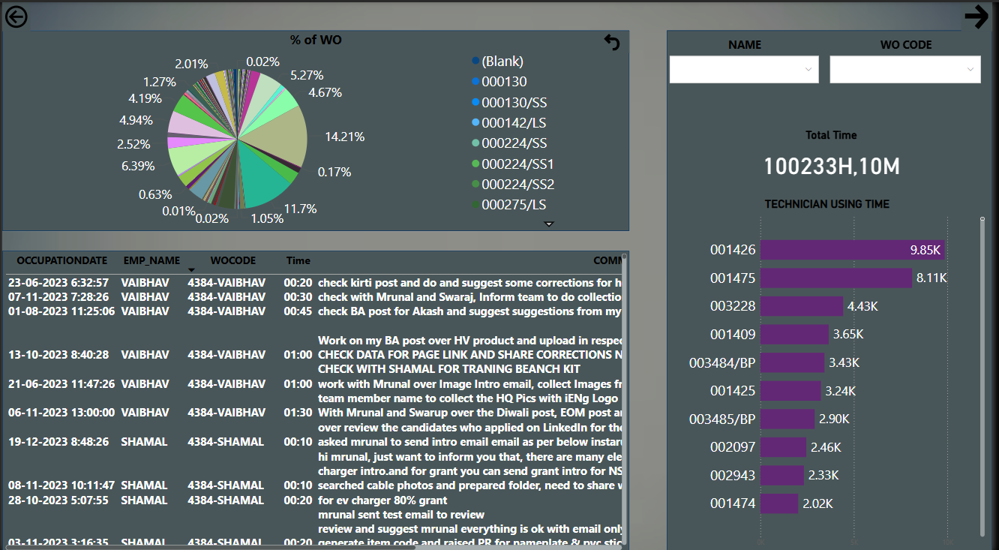

# 📊 Technicians Working Data Analysis - Power BI Project

## 🧠 Overview

This Power BI report is designed to analyze and monitor technician(Employee) work orders, time spent, activity types, and department productivity. It provides management and team leaders with a clear view of team efficiency, technician workload, and time utilization across different work orders or ptojects.

---

## 📌 Objectives
Every hour or certain time they shouls update there Labour sheet, lets say this hour I worked on this, employee(Technician) must update comment, may be 30min,hour wise or certain time they used.

- Analyze technician(Employee)-wise working time and work order count to know progress of work orders or work with proper comments of each hour/mins.
- Breakdown of activity types and action types, by looking these types HR finds where he really spotted the time, some imp types they should work to elligible for rewards.
- Some rewarded actions are QUOTATION,DELIVERY,SERVICE,MARKETING,FOLLOWUP,LEAD,TENDER,DEMO
- - Team-wise performance and employee involvement.
- Visual insights to help IT and management take quick decisions.

---

## 📂 Report Pages

### 🔹 Page 1: Technician Summary Dashboard
- **WO Count** and **Total Time** across selected duration.
- Filter by **Team**, **Employee**, and **Date Range**.
- Donut chart of **Activity Type %**.
- **Top technicians** by time spent on Work Orders.
- Breakdown of **Action Types** and their frequency.

### 🔹 Page 2: Detailed Work Order Logs
- Interactive **pie chart** of % of Work Orders by code.
- Tabular view of each entry with:
  - Date
  - Employee Name
  - Work Order Code
  - Time spent
  - Description/Comments
- Technician ranking by time in bar chart.
- Filters for **Employee Name** and **WO Code**.

## 📸 Screenshots

### 🔹 Main Page

### 🔹 Comments Page

---

## 🛠️ Tools & Technologies Used

- **Power BI** for report creation and data modeling.
- **SQL** for data querying and preprocessing.
- **CARL** asset management software (data source and operations integration).

---

## 👨‍💻 About Me

Hi, I'm **Pagidi Ramesh**, a Power BI Developer with **2.4 years of professional experience**. I have independently developed, delivered, and maintained end-to-end analytics solutions. I'm also experienced in training others — having mentored 3 colleagues on Power BI.

- 📬 **Email**: ramshpagidi2@gmail.com  
- 🔗 **LinkedIn**: [pagidi-ramesh](https://www.linkedin.com/in/pagidi-ramesh-477a09211)  
- 🧑‍💼 **Role**: Power BI Developer | Python Data Analyst | Azure Data Professional
